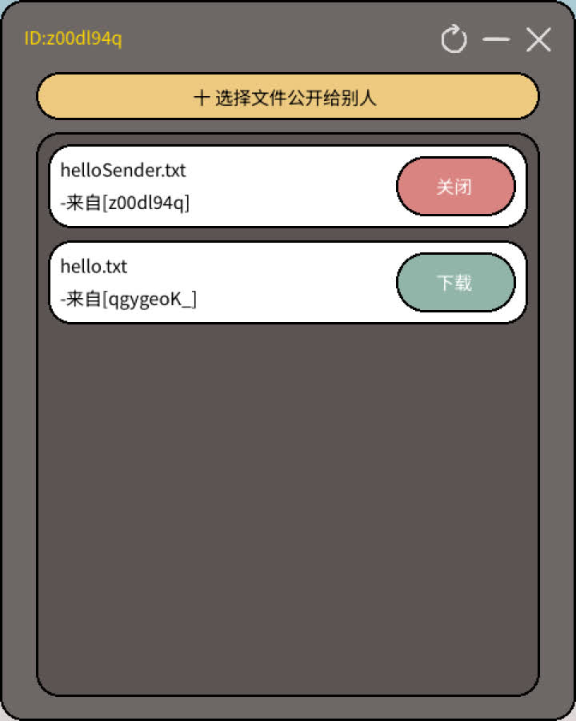
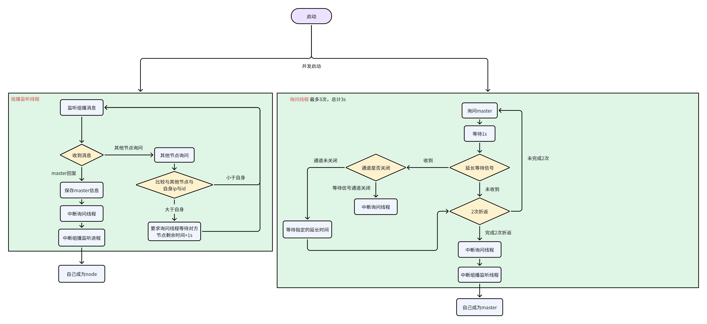

# gmsender 
# 局域网文件共享工具

## 界面概览

| 最大化样式 | 最小化样式  (注：此时鼠标左键双击小球可以放大)|
|-----|-----|
| {width=300px}| |

软件包体大小：21.15MB

## 功能
1. 选择文件公开给局域网内其他用户，可随时关闭共享
2. 可自由下载局域网内已经公开的文件，无需对方额外同意

## 使用方法
以下2个方法选其一
1. 直接启动tool/gmsender.exe，可以移动到其他目录，软件运行不依赖目录
2. 自行编译：sh build.sh，编译结果在tool/gmsender.exe,也可以自行在build.sh中修改目标目录

## 技术细节

### 自身ip

1. 软件启动时会ping 8.8.8.8以获取自身的实际通信ip，如果用户设备处于完全内网状态，则会尝试用网络配置中读取本地ip
2. 故只要能与其他客户端路由就可以使用，如果有自己指定的dns可以在pkg/netfinder/ip.go的getLocalIp()函数中配置

### 分布式节点

1. 软件启动后在局域网内借助广播相互通信，商量出一个master，为尽量减少广播消息master不会有广播心跳
2. 由于广播有一定概率会丢包或者被路由拦截，所以可能有小概率因无法相互沟通而出现多master等异常行为，多master在再次收到010指令消息时可能会放弃master身份来与新的master建立连接，具体策略为判断自身ip与id与对方的关系
3. 如果因丢包等引起的通信无法建立，可以直接点击右上角的刷新尝试与其他客户端建立联系，或者等待局域网广播正常后再进行通信
4. 节点间进行文件下载时采用的是tcp一对一连接，不经过master转发，故文件通信过程中不受master或者网络广播影响
5. 文件请求下载时不会再与提供文件方再次确认，如果希望文件不再公开请及时关闭自己的公开文件
6. master和node在界面上会有id颜色的区别样式如下：
   master颜色   
   node颜色   
7. id是由uuid随机生成，不与设备硬件地址等敏感信息相关，每次启动时随机生成

## 通信指令集

|指令名|编码|类型|结构|备注|
|-----|----|----|----|---|
|询问master|001|广播|code[0-2] 编码 wait[3-7] 等待剩余秒数 struct{ &emsp;ip string // 来源ip &emsp;port string // 来源点对点通信端口 &emsp;id string // 来源id }|任意节点发出|
|master回复|010|广播|code[0-2] 编码 struct{ &emsp;ip string // 来源ip &emsp;port string // 来源点对点通信端口 &emsp;id string // 来源id }|master发出|
|请求文件下载|011|tcp|code[0-2] 编码 fileName[3-...]文件名|一对一通信|
|询问公开文件列表|100|udp|code[0-2] 编码 |节点发出|
|回复公开文件列表|101|广播|code[0-2] 编码 struct{ &emsp;ip string // 来源ip &emsp;port string // 来源点对点通信端口 &emsp;id string // 来源id &emsp;FileName string // 文件名 }|master发出|
|公开自己的文件|110|udp|code[0-2] 编码 struct{ &emsp;ip string // 来源ip &emsp;port string // 来源点对点通信端口 &emsp;id string // 来源id &emsp;FileName string // 文件名 }|节点发出|
|删除自己的公开文件|111|udp|code[0-2] 编码 struct{ &emsp;ip string // 来源ip &emsp;port string // 来源点对点通信端口 &emsp;id string // 来源id &emsp;FileName string // 文件名 }|节点发出|

## 渲染

**渲染主要采用图片素材直接展示与shader渲染，底层由openGl负责shader渲染，渲染主要占用核显，不占用独显，具体如下**
**shader会在程序启动时编译**
|部分|渲染路线|
|---|---|
|右上角功能按钮|图片素材|
|最小化界面|图标素材|
|文本|字体渲染为静态图绘制|
|按钮边界|shader|
|动态效果|shader|

## 性能

|测试机硬件|详情|
|---|---|
|处理器|13th Gen Intel(R) Core(TM) i9-13980HX   2.20 GHz|
|机带 RAM|64.0 GB|
|GPU核显|Intel(R) UHD Graphics 8GB|
|GPU独显|该软件渲染需求极低，不占用独显|

|状态|fps|行为|平均cpu占用|内存|gpu核显占用率|
|-----|----|----|----|---|---|
|最大化|24|所有操作|约0.13%|约200MB|约6%|
|最小化|12|展示周几，自己的公开文件可以被下载|约0.06%|约200MB|约25%|

ps：如果想想修fps，可在utils/const.go中修改如下变量，修改后可重新构建
- BigTPS           = 24 // 放大时的帧率
- SmallTPS         = 12 // 缩小时的帧率

## 选主流程图

